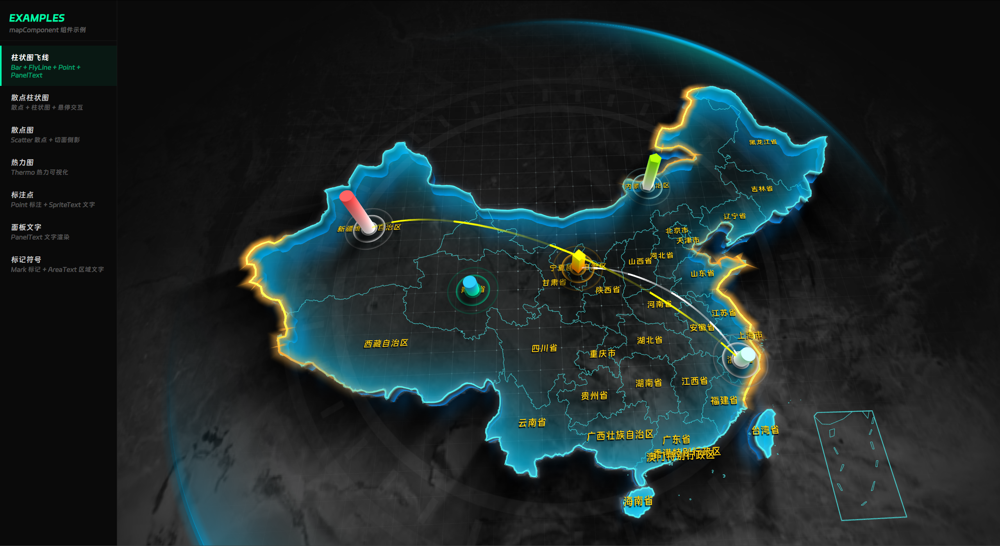

<p align="center">
  
</p>

# BeautiMap

独立开源 3D 地图可视化 WebGL 组件，零 3D 库依赖，基于原生 WebGL2/WebGL1 渲染中国地图，支持省市级下钻与多种可视化图层叠加。

## 特性

- **零依赖** — 不依赖 Three.js 或其他 3D 库，自研矩阵运算、几何、相机系统
- **WebGL2 优先** — 自动回退 WebGL1，开箱即用
- **丰富的图层组件** — 柱状图、飞线、散点、热力图、标注、面板文字等
- **省市级下钻** — 支持 click 下钻到省/市，带过渡动画
- **事件系统** — 内置 Ray Casting，支持 click / hover / dblclick 交互
- **属性动画** — 内置缓动动画引擎，支持任意属性插值

## 快速开始

### 安装

```bash
npm install
```

### 开发

```bash
npm start
```

启动开发服务器（端口 88），自动打开示例菜单页面。

### 构建

```bash
npm run pack
```

输出 UMD 包到 `dist/beauti-map.js`，全局变量名 `BeautiMap`。

## 使用

```typescript
import { Map3D, MapData, BackgroundArea, Bar, FlyLine } from 'beauti-map'

const map = new Map3D({ el: '#container' })
const mapData = new MapData(geoJson, 'Mercator')

// 创建图层
const background = map.createChild('BackgroundArea')
background.setProps({ border: { color: '#ccc' } })
background.height = 50

const bar = map.createChild('Bar')
bar.setData([
  { point: '110000', height: 100, radius: 10, topColor: '#ff4949', bottomColor: '#fff', splitNum: 20 }
])

map.addChild(background, bar)

// 绑定数据
background.setMapData(mapData)
bar.setMapData(mapData)
map.setMapData(mapData)

// 交互
background.on('areaClick', (area) => {
  console.log('点击了:', area.properties.name)
})
```

## 可用组件

| 组件 | 说明 |
|------|------|
| BackgroundArea | 地图区域底图，支持边框、纹理、背景色 |
| Section | 区域侧面挤出，支持倒影效果 |
| Boundary | 区域边界线，支持虚线、发光 |
| Bar | 3D 柱状图 |
| FlyLine / FlyLine2D | 飞线动画 |
| Scatter | 散点图 |
| Thermo | 热力图 |
| Point | 光点 |
| Mark | 自定义图标标注 |
| GridPanel | 网格面板 |
| CirclePanel | 圆圈脉冲面板 |
| TexturePanel | 纹理底图面板 |
| EffectLight | 边界流光效果 |
| Trace | 轨迹线 |
| PanelText | 面板文字 |
| AreaText | 区域文字 |
| SpriteText | 精灵文字 |
| Content | 自定义内容层 |

## 技术架构

```
src/
├── core/           # 核心层
│   ├── Map3D.ts    # 顶层地图类
│   ├── GLRenderer  # WebGL 渲染器
│   ├── Node        # 场景树节点
│   ├── layers/     # 图层基类 (GL3DLayer, GLPanelLayer)
│   └── data/       # 数据系统 (MapData, FilterMapData)
├── engine/         # 自研引擎
│   ├── webgl/      # Shader / Buffer / Texture / RenderTarget
│   ├── math/       # Matrix3D / MathUtil
│   ├── camera/     # SphericalCamera
│   └── animation/  # AnimationUtil + EaseFunctions
├── components/     # 可视化组件（每个组件含 index.ts + shader.ts）
└── utils/          # 工具函数
```

## License

MIT
